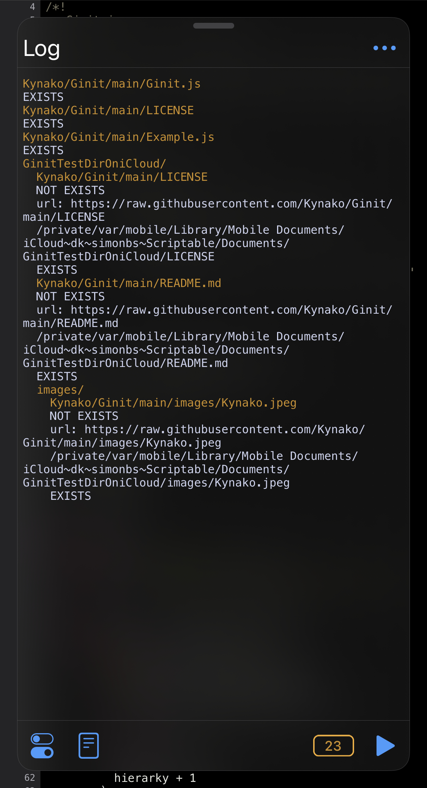

# Ginit
Import scripts from guthub easily

## Overview


## Usage
```javascript
let list = [
  'Kynako/Ginit/main/Ginit.js',
  {
    dir: 'GinitTestDir/',
    list: [
      'Kynako/Ginit/main/LICENSE',
      'Kynako/Ginit/main/README.md'
      {
        dir: 'images',
        list: [
          'Kynako/Ginit/main/images/Kynako.jpeg'
        ]
      }
    ]
  }
];
const fm = FileManager.iCloud()
const Ginit = importModule('__Ginit_FilePath__')
const ginit = new Ginit();
await ginit.set(list, fm.documentDirectory() + '/');
```

Also you can try quickly with [Usage.js](/Usage.js)
## Requirememt
- Scriptable v1.6.3

## License
[MIT license](/LICENSE)
